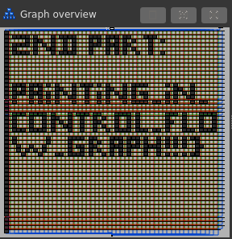

# Painting

### Category

Misc

### Description

Your software engineer sent you this file, making a proud face. 
Can you find the flag ?

Format : **Hero{flag}**<br>
Author : **SoEasY**

### Files

 - [Painting](Painting)

### Write up

1st part of the flag:
```
$ strings Painting | grep Hero
1st part: Hero{OMG_I_love_so_much_
```

2nd part of the flag:
Open `Painting` in IDA (or other disassembler) and look at the control flow graph:


### Flag

```
Hero{OMG_I_love_so_much_painting_in_control_flow_graph!!!}
```
