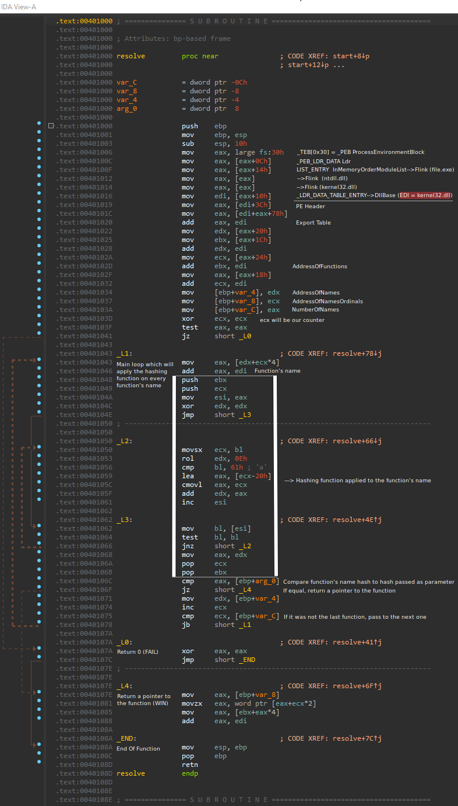

# Resolver

### Category

Reverse

### Description

You are trying to get into a malware development forum and an administrator gives you this challenge to solve to get in.

According to him, this function is used for dynamic resolving.
He wants you to give him the values to pass as parameters to resolve the following functions:
- GetDateFormatWWorker (val1)
- IsWow64GuestMachineSupported (val2)
- SetThreadPreferredUILanguages (val3)


Format : **Hero{flag}**<br>
Author : **SoEasY**

### Files

 - [Resolver.png](Resolver.png)

### Write up

This challenge is inspired by a Buer Loader malware sample that I've reversed some time ago. You can find it here: https://bazaar.abuse.ch/sample/ae3ac27e8303519cf04a053a424a0939ecc3905a9a62f33bae3a29f069251b1f/.

Secondly, you'll have to find some ressources on Windows internal structures (TEB, PEB, ...) and PE format. I personally user those:
- https://www.aldeid.com/wiki/TEB-Thread-Environment-Block
- https://www.aldeid.com/wiki/PE-Portable-executable

With all of this, we can create an annoted version of [Resolver.png](Resolver.png):


The next step is to implement the hashing function (in Python for example), to dump all the exported function from `kernel32.dll` (I did it with IDA) and apply the function no every function name. We can then create a solving script:

```py
def ROR(x, n, bits=32):
    mask = (2**n) - 1
    mask_bits = x & mask
    return (x >> n) | (mask_bits << (bits - n))


def ROL(x, n, bits=32):
    return ROR(x, bits - n, bits)


def compute_checksum(function_name):
    sum = 0
    for c in function_name:
        c = ord(c)
        sum = ROL(sum, 0xE)
        if c < 0x61:
           sum += c
        else:
            sum += (c - 0x20)
    return sum


def main():
    result = {}
    export_table = open('kernel32_exports.txt', 'r')

    for line in export_table:
        function = line.split()[0]
        if function in ["GetDateFormatWWorker", "IsWow64GuestMachineSupported", "SetThreadPreferredUILanguages"]:
            hash = hex(compute_checksum(function))
            result[function] = hash
    export_table.close()
    
    print(f"[+] Result: {result}")
    print("[+] Flag: Hero{" + f"{result['GetDateFormatWWorker']}:{result['IsWow64GuestMachineSupported']}:{result['SetThreadPreferredUILanguages']}" + "}")


if __name__ == '__main__':
    main()
```
Result:
```bash
$ python3 solve.py 
[+] Result: {'GetDateFormatWWorker': '0xe3232703', 'IsWow64GuestMachineSupported': '0x89291c8b', 'SetThreadPreferredUILanguages': '0xac881638'}
[+] Flag: Hero{0xe3232703:0x89291c8b:0xac881638}
```

### Flag

```
Hero{0xe3232703:0x89291c8b:0xac881638}
```
