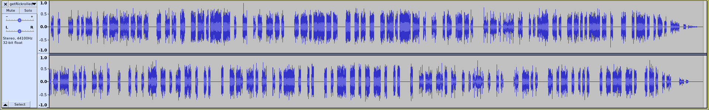

# GetRickRolledInSuround

### Category

Steganograpy

### Description

This rickroll is hiding something...

Format : **Hero{flag}**<br>
Author : **Log_s**

### Files

 - [getRickrolled.wav](getRickrolled.wav)

### Write up

It's easy to notice that the sound is alternating between the left and right channel. Here is an audacity overview.



I wrote a tool to encode and decode data from a 2-channeled wav file : https://github.com/Log-s/StereoSteg

The idea is to set a bit length to the smallest consecutive audio sequence on any channel. Then, we just have to set a 0 or 1 (to know which one, juste try both combinations) for each channel.

### Flag

```
Hero{l3f7_r1gh7_l3f7_r1gh7_1_4m_d1zZy}
```
