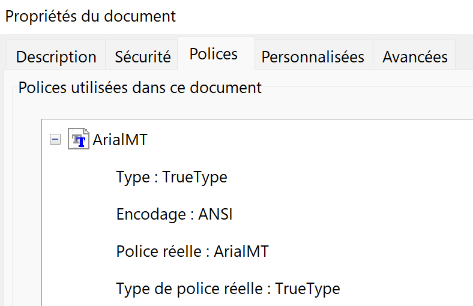
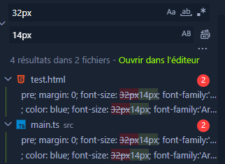
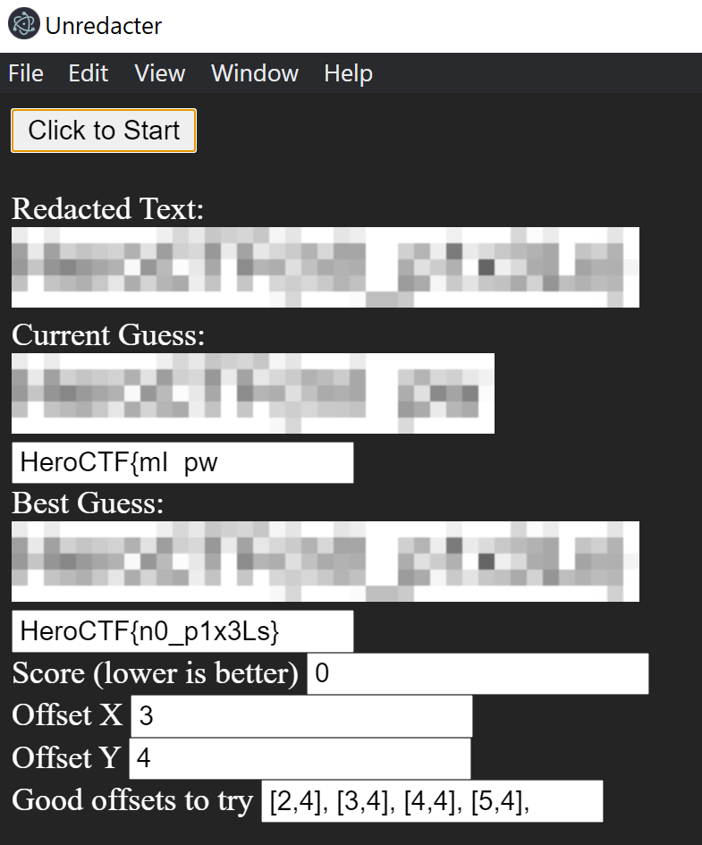

# Redacted

### Category

Steganograpy

### Description
An admin leaked a confidential document. Unfortunatly, the juicy part is redacted... But that won't stop you, will it ?

<b>/!\ The flag format is different from the other flags !</b>

Format : **HeroCTF{flag}**<br>
Author : **Log_s**

### Write up

The only piece of information we dispose of for this challenge is a PDF file.

The goal is pretty clear, read the redacted text. A few blog posts online redirect to this tool: [https://github.com/BishopFox/unredacter](https://github.com/BishopFox/unredacter)

The demos are pretty impressive, but the difficulty is that it's just a POC, and the tool is very sensitive to input and very very slow (if someone volunteers to rewrite the program in C++ and not show all the useless data that slows the tool down, I'd be happy to hear about it).

According to the bit of documentation available on the Github repository, we have to crop down the pixilated area just right.

For maximum quality, let's zoom in on the document, and take a screenshot with a bit of safe distance around.


Then, let's crop it down to fit the redacted text to the pixel. This is the result.


Next, it needs to fit the size the tool is handling. There are two choices, the first is to resize the image to fit a height of 40px (the code indicated that each bloc is 8x8px, and this information can be found by generating a redacted text with the tool and analyze it), or to change the block size in the tools source code. After a few tests, I found that the most efficient is to resize the cropped image. Here we go.


But if you want to save yourself the trouble, you can just extract the image I pasted into the document :) [https://pdfcandy.com/extract-images.html](https://pdfcandy.com/extract-images.html).As they say, word smarter, not harder.

Still, according to the documentation, the next step is to set up the font and font size. There are a few ways to determine these pieces of information from a PDF file. Here is one. If you open the file with Acrobat Reader for example, you can go to Files > Properties > Font.



The font is Arial.

For the size, you can copy a text portion, and paste it into word, by keeping the origin formating. This way technique can also give you the font in addition to the font size, but not necessarily.

14px.

Let's update the source with these values. The default font is already Arial, let's just set the size to 14px.



Next, the documentation tells us to modify `preload.ts` to make it fit the desired charset. Let's input the charset usually composing a flag `abcdefghijklmnopqrstuvwxyzABCDEFGHIJKLMNOPQRSTUVWXYZ0123456789_{}` .

The last step is to place our image in the root folder of the app and rename it as `secret.png`. Let's run it ! (it can take quite some time :( )



### Flag

```HeroCTF{n0_p1x3Ls}```