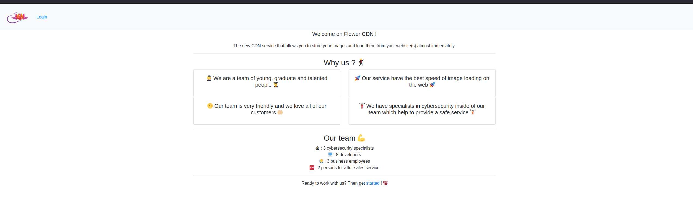
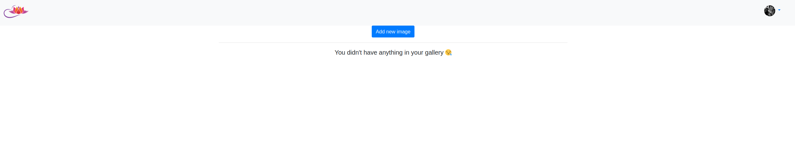
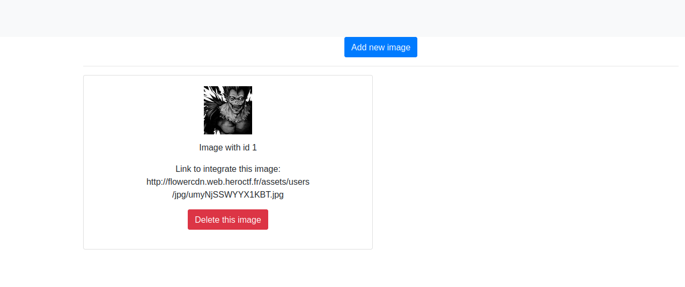
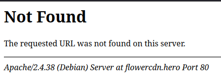
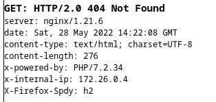
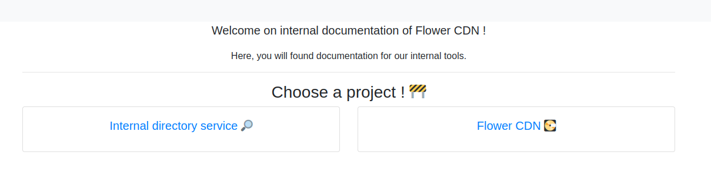
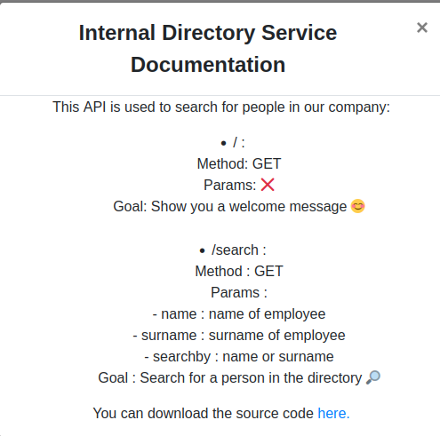
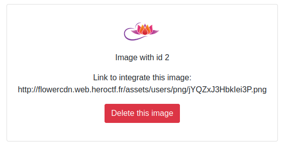

# Flower CDN

## Category

Web

## Author

Worty

## Description

You are mandated to pentest this new CDN solution. To prove your exploitation, the company claims that it is impossible for you to reveal the name of its general manager, who is supposed to remain secret. It's up to you to find him.

https://flowercdn.web.heroctf.fr

Format : Hero{name:surname}

Author : Worty

## Solve

We land on this website :



So we register an account, and we land on the main page of the challenge :



Next, we have two choices to add an image :
- From our local storage
- From a URL

In this WriteUp, I will not use the upload from local storage because there isn't any vulnerabilities on it, the most interesting is the URL.

So we can try to add a legit image (https://pbs.twimg.com/profile_images/1257438197149294596/EaA1JF_x_400x400.jpg) :



Okay so it's just a basic CDN that store our image for us and provide us a URL to reach them from another website.

First we are going to do a recon on specific things to identify potentially leak from the application :
- In 404/403 error :



- In header response of the server :



So the applications leaks two things that will be useful :
- The internal DNS
- Is IP inside the internal network

So with the internal DNS, we could try to bruteforce the subdomains with this command (don't forget to overwrite your /etc/hosts file) :

```sh
> wfuzz -c -f sub-fighter -w subdomains-top1million-5000.txt -u 'https://flowercdn.hero' -H "Host: FUZZ.flowercdn.hero" --hw 34 
********************************************************
* Wfuzz 3.1.0 - The Web Fuzzer                         *
********************************************************

Target: https://flowercdn.hero/
Total requests: 4989

=====================================================================
ID           Response   Lines    Word       Chars       Payload                                                                                    
=====================================================================

000002832:   401        14 L     54 W       475 Ch      "documentation"
```

And we recover a subdomain but it require a basic auth, let's try some basic credentials ! Here, `admin:admin` works to connect to it :





And we recover the source code of an internal application that aim's to search for internal people in the company ! That's perfect, because the goal of this challenge is to recover the name and the surname of a secret person inside this company.

The source code is small (around 40 lines):

```py
from flask import Flask, request
from time import sleep
from json import loads

employees = loads(open("employees.txt","r").read()) #todo : use ldap queries to recover users

app = Flask(__name__)
@app.route('/',methods=["GET"])
def index():
    return "Welcome to the internal employee search api. To use this service, please read the associated documentation on the associated private github repository."

@app.route('/search',methods=["GET"])
def search():
    if(request.args.get("name") and request.args.get("surname") and request.args.get("searchby")):
        if request.args.get("searchby") in ["name","surname"]:
            searchBy = request.args.get("searchby")
            for employee in employees:
                found = True
                for i in range(len(request.args[searchBy])):
                    if i >= len(employee[searchBy]): break
                    if(request.args[searchBy][i] == employee[searchBy][i]):
                        #we load this library from our modified python binary, so don't be afraid to not have this method, it is included in your workspace ;)
                        #moreover, we fix the log4j vulnerability and now we use a tool developed by google as third party, so no more RCE.
                        #todo: fix delay between this server and the logger of google, it's quite long and boring for big queries
                        send_search_to_logger(f"{ip} search for caracter {request.args[searchBy][i]}") 
                    else: 
                        found = False
                        break
            if(found):
                return f"Found an employee that match your research (potentially partially): {employees[0]['name']} {employees[0]['surname']}"
            else: return "Not found"
        else: return "Invalid value for parameter 'searchBy'"
    else: return "Missing parameter, please check the documentation."

app.run(host="0.0.0.0",port="80")
```

Here, we can see that the name (or surname) is compared caracter by caracter, and if a caracter match, it will log the search of the user. As we can see in the code, there is a delay to log this. This will be important for the last part of the challenge.

The last thing to see is on the main website, in fact, we can provide a URL, but what happened if we provide an internal IP such as "http://localhost/assets/img/logo.png" ? Let's see :



And... it works ! We've got a SSRF on the application.

So, this is the exploit chain :
- Trigger the SSRF
- Enumerate network with the "x-internal-ip" recover at the beginning
- Find the IP of the internal API used to search for people
- Perform a Time Based Blind SSRF to leak the name and surname of the general manager
- Flag

To exploit this, we can use this script :

```py

```

And we recover the flag ! \o/

## Flags

Hero{Dominique:Lavigne}